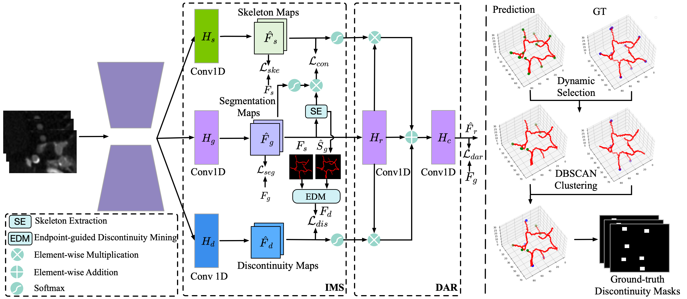
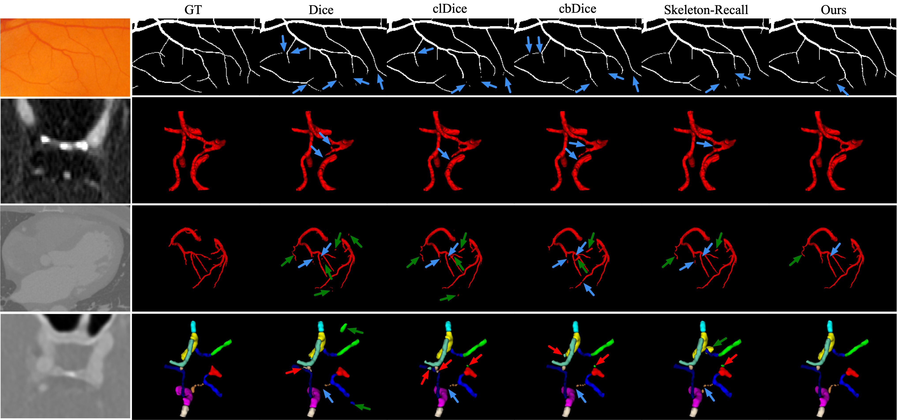

# GLCP: Global-to-Local Connectivity Preservation for Tubular Structure Segmentation
[](https://miccai.org/)

### 🎉 This work is early accepted by [MICCAI 2025](https://conferences.miccai.org/2025/en/default.asp)!
## Overview

This repository contains the code for **"GLCP: Global-to-Local Connectivity Preservation for Tubular Structure Segmentation"**! The propose GLCP can be integrated within the popular [nnUNet framework](https://github.com/MIC-DKFZ/nnUNet).



## Dataset
The method is validated on several public datasets, including:

- [**STARE**](https://cecas.clemson.edu/~ahoover/stare/): Retinal blood vessels (2D).
- [**TopCoW**](https://topcow23.grand-challenge.org/): Circle of Willis vessels in the brain (3D).


## Usage
### Installation

Please follow  the official [nnUNet V2](https://github.com/MIC-DKFZ/nnUNet).

### Training

for 2D:
```bash
nnUNetv2_train DATASET_NAME_OR_ID 2d FOLD -tr nnUNetTrainer_2DUnet_NoDeepSupervision_CE_DC_crit_ske_refine
```

for 3D:
```bash
nnUNetv2_train DATASET_NAME_OR_ID 3d_fullres FOLD -tr nnUNetTrainer_3DUnet_NoDeepSupervision_CE_DC_crit_ske_refine
```


## Citation
To be updated...
